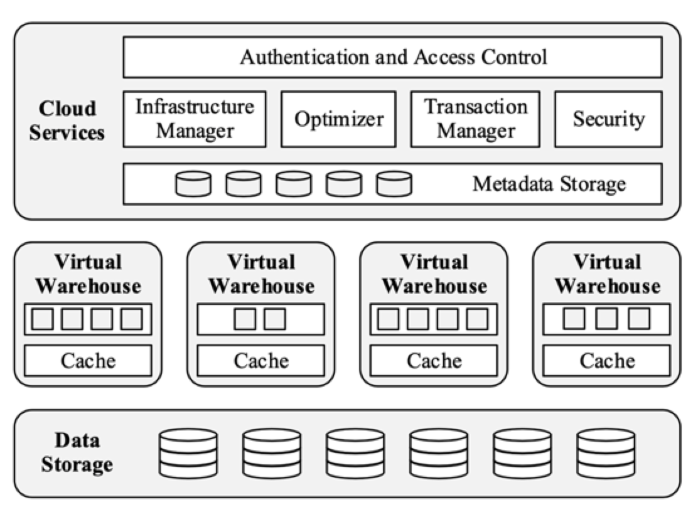
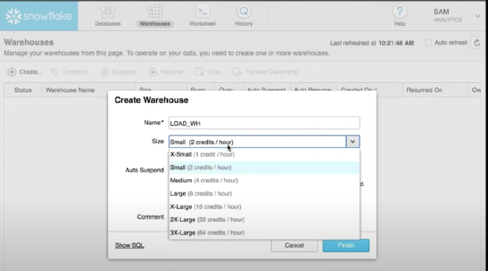
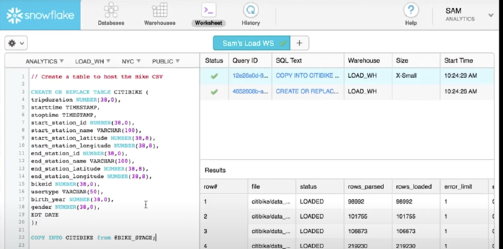
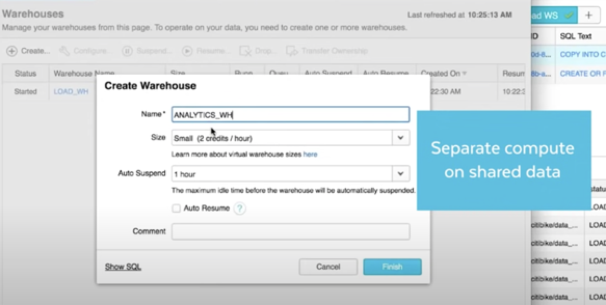
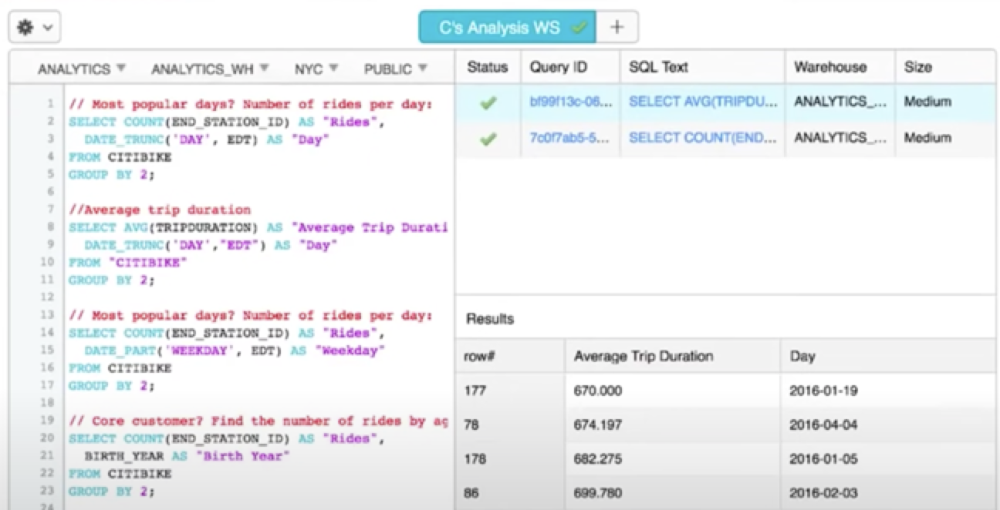
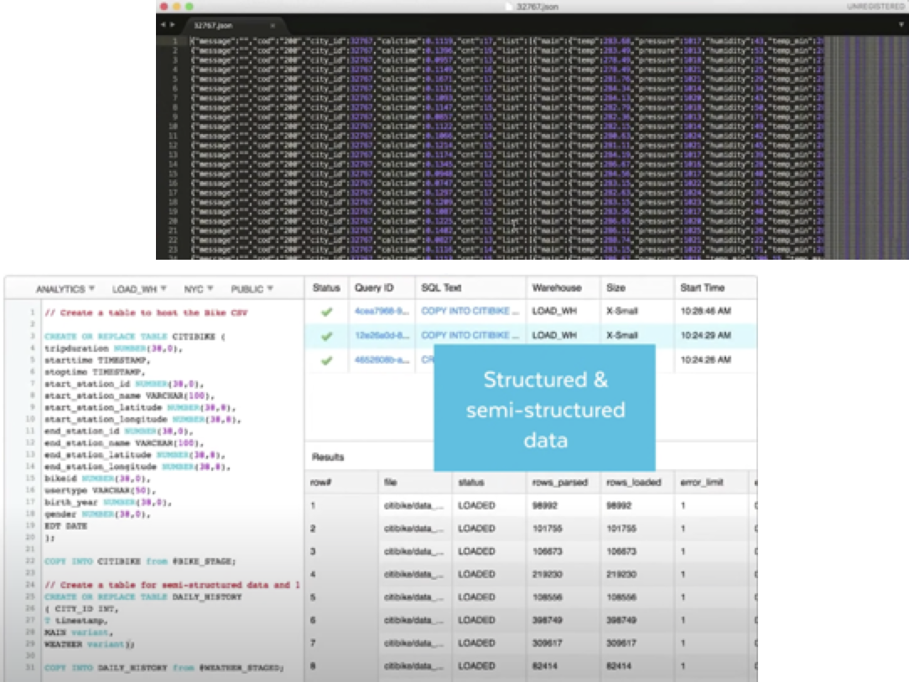
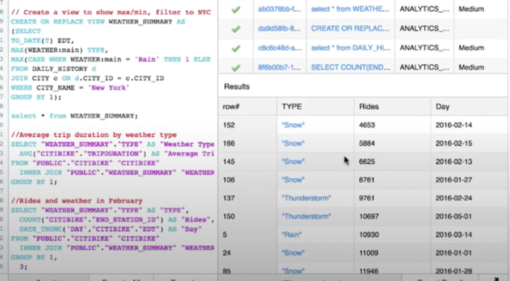
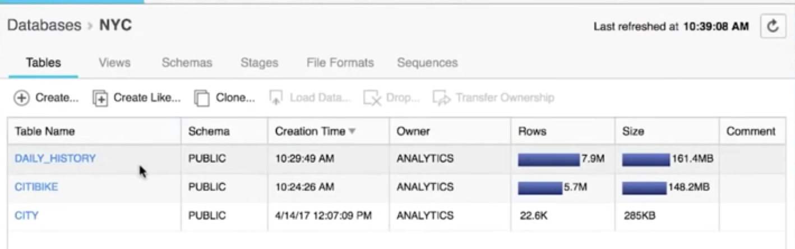
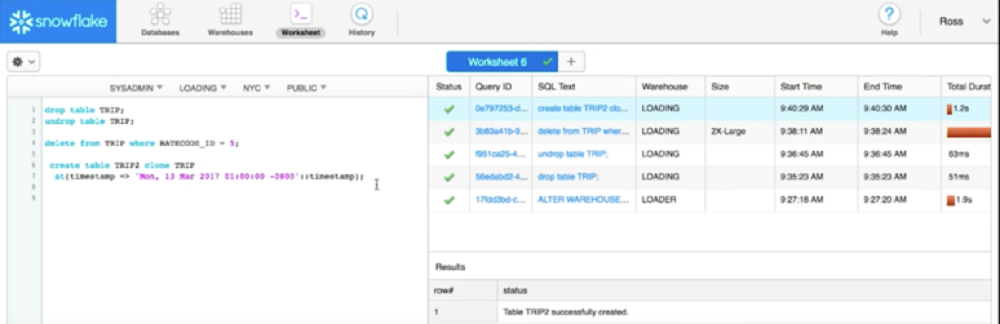

最近在部门内部分享了 Snowflake 的调研，整理一篇文章出来记录一下。国内网上资料不算多，主要内容来自于官网和 2016 年发表的论文<The Snowflake Elastic Data Warehouse>。

## Snowflake 简介

Snowflake 是当下云原生领域的明星公司，主打 100% 云原生的数据仓库产品。成立于 2012 年，2014 年基于 AWS 发布产品，2018 年上微软 Azure，2019 年上 Google GCP，2020 年上市，刚上市市值就突破700 亿美金，现在已超过 1000 亿。

目前 Snowflake 的客户数接近 5000 家，其中世界 500 强的客户达到 212 家。

##Snowflake 优势

### 技术前瞻

公司由三名资深数据仓库专家创立，初始研发团队总计有 100 多年的数据库研发经验。

2012 年公司创立时，正是 SQL on Hadoop 最火的时候，但当时他们已选定了存算分离，依托于公有云研发SaaS 产品的模式。纯 SaaS 的模式对用户屏蔽了底层细节，不仅方便用户使用，在内部产品迭代时也方便开发测试，无缝升级。

###计费方式

与云下采购服务器和堆技术团队不同，Snowflake 在云上真正实现了按用量付费，依据用户使用的计算资源规格和时间来计费，假如 1 单位的计算资源需要计算 4 小时，4 单位的计算资源需要计算 1 小时，用户等待时间非常不同，但价格相同，那用户自然更愿意选择后者，这在云下是很难做到的。

并且在产品设计上真正为用户考虑，用户创建了计算资源后可以设置空闲多长时间就自动挂起，停止计费，等下次使用时又自动恢复，非常友好。

### 用户体验

在产品使用时，用户只关注数据如何导入，如何建表查询，不需要关心集群运维情况，并且全程 WebUI 交互，对用户友好。

### 生态支持

Snowflake 支持各种标准接口 (JDBC/ODBC/Python) 与第三方工具 (Tableau/Informatica/Looker) ，也支持数据共享给其他用户，非常完善。

## Snowflake 架构

这是官方论文中的架构图，产品架构分为三层，底层是数据存储层，基于公有云的 S3 实现；中间是计算层，以虚拟仓库（Virtual Warehouse）为单位，不同规格对应不同数量的 EC2 实例；上层是云服务层，面向用户的纯 SaaS 服务，包含各种管控、安全、SQL 解析与优化、元数据存储等。

### 存储

Snowflake 最开始选择 AWS 作为初始平台，之所以选择 AWS，是因为 AWS 在当时是最成熟的云平台，也就有最多的潜在客户，方便以后的客户拓展。存储方面是选择 AWS 上的 S3 还是自研呢？鉴于 S3 在易用、高可用、数据持久性上做的已经很好，自研成本太高并不划算，所以选择直接用 S3，这样自己可以把精力更多集中在本地缓存和数据倾斜处理等优化上。

S3 的访问比本地访问延迟高，CPU开销也大，每个对象（文件）只能被一次性写入或者被覆盖，不支持 append 写，但是支持一次读取文件中的一部分。这些特点也影响了 Snowflake 的存储设计。Snowflake 存储横向划分为多个文件，每个文件内部采用列存格式，支持压缩，每个文件有一个文件头，其中包含了每列对应的 offset，访问时根据文件头中的 offset 来读取对应的内容。

S3 中除了存储用户的原始数据，还会存计算时产生的中间数据，这样就不会受限于计算节点的内存和本地存储，可以支持无限大的计算量。

### 计算

计算层暴露给用户的概念是 Virtual Warehouse，不暴露底层的 EC2 实例，同时 VW 像买衣服一样的标准化， 用 XS -> XXL （最新已经到 4X 了）命名规格，对应不同数量的 EC2 实例。并且按规格和使用时间计费。

Snowflake 存储共享，计算独立，同一份存储上可以对应多个VW，VW 之间资源是隔离的，互不影响。并且VW 的创建和销毁不影响存储，方便不同角色的用户做数据建设和数据分析等使用。计算节点本地存储为 SSD，保证缓存性能。为了不影响短查询的性能，保留了部分计算进程是可复用的，减少了进程启停的开销。

每个 VW 的工作节点都会在本地磁盘上维护一份缓存，即最近被查询访问过的表文件（只有被访问的列文件），这个缓存被节点上所有的计算进程共享。不同 VW 可能访问同一个文件，都会缓存在本地，为了减少重复的缓存开销，同一个文件的访问请求会 hash 到同一个工作节点，来复用缓存，降低成本。

多种原因都可能导致有些节点执行较慢，Snowflake 在 scan 阶段做了优化（File Strealing）。一个节点把它的输入文件列表 scan 完成后，会向其他节点发起请求，如果其他节点还有很多文件未处理，就会将这些文件的处理权移交给快节点，这样快节点就会直接从 S3 中读取文件，降低慢节点的压力，保障整体的处理速度。

Snowflake 自研的计算引擎中，也用到了列存、向量化计算、结果下推等主流的优化方法。

###云服务

由于这部分负载并不高，云服务层的资源是多租户共用的，只有逻辑隔离。其中的每个服务都支持高可用，任意一个节点故障都不会导致数据丢失或不可用，只可能导致部分查询失败（可自动重试）。

所有的查询都会通过云服务层，这里会完成查询的解析、鉴权和优化。查询优化器支持 CBO，优化用到的所有统计信息会在数据导入时和更新时自动更新。优化完成后，会把执行计划分发到具体的执行节点。在执行过程中，云服务也会持续收集查询的状态、性能相关的 counter 和检测节点故障。并且会将相关监控和分析图形化地展示给用户。

Snowflake 主要针对分析型场景设计，支持大量读、批量或少量写以及批量更新。并通过快照隔离实现了事务支持，快照隔离基于多版本并发控制（MVCC）实现，也是基于 S3 文件不可变的自然选择。

Snowflake 的查询并不支持传统的索引，主要是因为 S3 不支持随机读写，而且索引会增加存储量和加载时间，同时用户需要维护，成本较高。所以他们采用的是 min-max 裁剪，每个文件都在文件头中记录了这个文件的最大最小值，这样可以快速跳过不满足过滤条件的文件，而且无需维护，占用空间也小，适合顺序访问。裁剪还支持半结构化数据和表达式。

###更多特性

持续高可用，能够容忍任何单节点的故障。Snowflake 的元数据也随着 S3 的架构跨 AZ 多副本存储，单节点故障对用户影响不大。云服务的其他无状态组件也是跨 AZ的，通过 load balancer 把用户请求分发到不同 AZ 的实例上。与此不同的是，VW 并不跨 AZ，主要是出于网络延迟和带宽会影响性能的考虑，如果有节点故障影响了查询，会自动重试。为了尽量减少重试的影响，snowflake 也维护了一个备用节点池，可以直接替换，节省掉节点启动的开销。如果整个 AZ 挂掉，则需要用户主动在其他 AZ 重建一个 VW，由于概率极低，认为是可接受的。

 支持多版本滚动升级，对用户不可见。元数据存储在独立的 KV 系统里，通过根据版本和 schema 变化分发的映射层访问，每次变更也会保证向后兼容。每次升级时新旧版本会同时存在，旧版本上的查询结束后，新查询会被路由到新版本上，然后旧版本下线。

支持半结构化数据，支持了 VARIANT/ARRAY/OBJECT 三种数据类型，用于存放半结构化数据，包括比较流行的 JSON/Avro/ORC/Parquet/XML 等格式。Snowflake 内部的编码方式让对半结构化数据的打平和聚合操作都非常的高效，并针对半结构化数据也应用了列存、表达式下推等存储查询优化，对比结构化数据查询性能大概只慢 10% 左右。

支持时间旅行，基于 MVCC 的快照隔离，支持回滚到一段时间内的任意版本，也支持拷贝任意版本的快照来生成一个新的表。

安全方面也做了很多工作，不细展开。

##使用示例

官网视频有个简单的例子，可以看看数据建设者和数据分析者如何使用 Snowflake。

数据建设者创建一个 VW，只需要命名、选择规格、设定自动挂起的时间即可，一键部署集群。

导入结构化数据，从本地 CSV 文件上传，通过建表语句和一个 copy 语句建表和导入数据。在导入过程中自动完成分区和 min-max裁剪信息的收集。

数据分析者也创建一个 VW，和建设者的 VW 互相隔离，但共享存储。

分析者通过标准 SQL 查询表中的数据，在分析过程中发现数据不够丰富，需要建设者补充一些数据。

新的数据为 json 格式，同样可以支持导入，并把 json 数据存在 VARIANT 类型中。

分析者继续分析，不同的是查询半结构化数据时可以通过 WEATHER_SUMMARY.TYPE 的写法访问到 json 格式内层的数据，类似 JSON path。

使用结束后，可以看到相关表的统计信息，存储量、行数等。

图中可以看到，如果使用 drop 语句误删了某个表，还可以通过 undrop 语句恢复回来。当删除掉表中的一些数据后，还可以指定时间戳，来基于历史快照创建一个删除之前的新表，非常方便。
